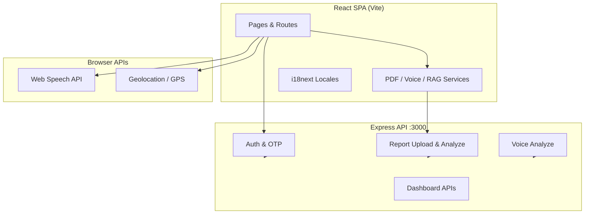

<div align="center">

# MediSense

### AI-Powered Health Companion — Medical Reports, Voice Symptoms & Multilingual Care

[](https://react.dev/)
[](https://www.typescriptlang.org/)
[](https://vitejs.dev/)
[](https://nodejs.org/)
[](https://tailwindcss.com/)
[](LICENSE)

**Turn complex medical reports into clear, personalized insights — in 20+ languages.**

[Features](#-key-features) · [Demo](#-quick-start) · [Architecture](#-architecture) · [API](#-api-overview) · [Docs](#-documentation) · [Author](#-author)

</div>

---

## Overview

**MediSense** is a full-stack health-tech web application built for **HackDay** and portfolio showcase. It demonstrates production-minded patterns: client-side document intelligence, REST API design, internationalization at scale, and an extensible AI analysis pipeline (RAG, structured extraction, personalization, confidence scoring, and human-in-the-loop review).

| | |
|---|---|
| **Problem** | Medical reports are hard to read; language and literacy barriers limit understanding. |
| **Solution** | Upload PDFs or describe symptoms by voice → get structured values, plain-language summaries, and source-grounded explanations. |
| **Audience** | Patients, caregivers, and developers evaluating full-stack + health-AI skills. |

> **Medical disclaimer:** For education and demonstration only. Not a substitute for professional diagnosis or treatment.

---

## Why This Project Stands Out (For Recruiters)

| Skill area | What you can evaluate in this repo |
|------------|-----------------------------------|
| **Frontend engineering** | React 18, TypeScript, Vite, React Router 7, Tailwind 4, Radix/shadcn UI, responsive layouts |
| **Full-stack design** | Express REST API, auth (JWT-style tokens), file uploads (Multer), optional MongoDB integration |
| **AI / health informatics** | PDF text extraction, OCR, medical value parsing, RAG-style grounding, confidence & uncertainty UX |
| **i18n / accessibility** | 20+ locales, script-specific fonts (Noto Sans), browser language detection |
| **Product thinking** | Dashboard, GPS clinic finder, OTP login flow, disease library, age-based content |
| **Documentation** | Architecture docs, setup guides, implementation notes, CI workflow |

---

## Key Features

### Core product

- **Medical report upload** — PDF parsing (PDF.js), lab value extraction, normal/high/low classification
- **Medical-only scanner** — Rejects non-medical documents with actionable errors
- **Voice symptom analyzer** — Web Speech API transcription + symptom/condition mapping
- **Health dashboard** — Metrics, appointments, report history, saved analyses
- **GPS clinic finder** — Geolocation-based nearby doctor/clinic search
- **OTP login** — Email-based verification via EmailJS ([setup guide](./EMAILJS_SETUP.md))
- **20+ languages** — i18next with extensive locale files

### Advanced analysis pipeline (5 layers)

1. **RAG** — Summaries grounded in WHO, CDC, NIH, AHA, Mayo Clinic–style sources  
2. **Structured extraction** — Key findings, trends, status, context per metric  
3. **Personalization** — Age, literacy level, condition-aware explanations  
4. **Confidence & uncertainty** — Known vs unclear markers, per-value reliability  
5. **Human-in-the-loop** — Doctor review workflow for validation  

---

## Screenshots

> Add 3–4 screenshots to `docs/screenshots/` and they will render here. Recommended: Home, Upload Report results, Voice Analyzer, Dashboard.

| Home | Report analysis |
|:----:|:---------------:|
| *Add `docs/screenshots/home.png`* | *Add `docs/screenshots/upload-report.png`* |

| Voice analyzer | Dashboard |
|:--------------:|:---------:|
| *Add `docs/screenshots/voice.png`* | *Add `docs/screenshots/dashboard.png`* |

See [docs/screenshots/README.md](./docs/screenshots/README.md) for capture tips.

---

## Tech Stack

| Layer | Technologies |
|-------|----------------|
| **UI** | React 18, TypeScript, Tailwind CSS 4, Radix UI, shadcn/ui, Recharts, Motion |
| **Routing & forms** | React Router 7, React Hook Form |
| **i18n** | i18next, browser language detector |
| **Documents** | pdfjs-dist, tesseract.js, mammoth |
| **Voice** | Web Speech API |
| **API** | Node.js, Express 4, Multer, CORS |
| **Data (optional)** | MongoDB / Mongoose ([setup](./MONGODB_SETUP.md)) |
| **Email** | EmailJS (OTP) |
| **Build** | Vite 6, Concurrently |

---

## Architecture



**Report analysis flow:** validate → detect medical document → extract text → parse metrics → RAG + personalization + confidence → display results.

Detailed breakdown: [docs/ARCHITECTURE.md](./docs/ARCHITECTURE.md)

---

## Quick Start

### Prerequisites

- Node.js **18+** (LTS recommended)
- npm

### 1. Clone & install

```bash
git clone https://github.com/Amrit000-HX/MediSense.git
cd MediSense
npm install
```

### 2. Environment

```bash
cp .env.example .env
```

Edit `.env` — minimum for local dev:

```env
VITE_API_URL=http://localhost:3000
```

### 3. Run (frontend + API)

```bash
npm run dev:all
```

| Service | URL |
|---------|-----|
| Frontend | http://localhost:5173 |
| API | http://localhost:3000 |

### 4. Try it

| Flow | Route |
|------|-------|
| Upload a medical PDF | `/upload-report` |
| Record symptoms | `/voice-analyzer` |
| Dashboard & GPS | `/dashboard` |
| OTP login | `/login` (requires [EmailJS setup](./EMAILJS_SETUP.md)) |

---

## Project Structure

```
MediSense/
├── .github/              # CI, issue & PR templates
├── docs/                 # Architecture, portfolio notes, screenshots
├── public/assets/        # Static assets
├── server/               # Express API
├── src/
│   ├── app/
│   │   ├── api/          # API clients
│   │   ├── components/   # UI & layout
│   │   ├── pages/        # Route pages
│   │   └── services/     # Analysis services
│   └── i18n/locales/     # 20+ language files
├── .env.example
├── package.json
└── README.md
```

---

## API Overview

Base URL: `VITE_API_URL` (default `http://localhost:3000`)

| Method | Endpoint | Description |
|--------|----------|-------------|
| `POST` | `/api/auth/signup` | Register |
| `POST` | `/api/auth/login` | Login |
| `POST` | `/api/auth/otp/send` | Send OTP (EmailJS) |
| `POST` | `/api/auth/otp/verify` | Verify OTP |
| `POST` | `/api/reports/upload` | Upload report |
| `POST` | `/api/reports/analyze` | Full analysis payload |
| `GET` | `/api/reports` | List reports |
| `POST` | `/api/voice/analyze` | Analyze voice/transcript |
| `GET` | `/api/dashboard/metrics` | Health metrics |
| `GET` | `/api/dashboard/appointments` | Appointments |

Auth header: `Authorization: Bearer <token>` (`medisense_token` in localStorage).

---

## Environment Variables

| Variable | Required | Description |
|----------|----------|-------------|
| `VITE_API_URL` | Yes | Backend base URL |
| `VITE_OPENAI_API_KEY` | No | Enhanced AI analysis (optional) |
| `VITE_EMAILJS_*` | For OTP | EmailJS service/template/key |
| `MONGODB_URI` | No | MongoDB connection ([guide](./MONGODB_SETUP.md)) |
| `PORT` | No | API port (default `3000`) |

Full list: [.env.example](./.env.example)

---

## Scripts

| Command | Description |
|---------|-------------|
| `npm run dev` | Frontend only (Vite) |
| `npm run server` | API only |
| `npm run dev:all` | Frontend + API |
| `npm run build` | Production build → `dist/` |

---

## Documentation

| Document | Description |
|----------|-------------|
| [docs/PORTFOLIO.md](./docs/PORTFOLIO.md) | **Interview guide** — skills, STAR stories, recruiter checklist |
| [docs/GITHUB_SETUP.md](./docs/GITHUB_SETUP.md) | Pin repo, topics, deploy demo, social preview |
| [docs/ARCHITECTURE.md](./docs/ARCHITECTURE.md) | System design & data flow |
| [docs/ADVANCED_FEATURES.md](./docs/ADVANCED_FEATURES.md) | RAG, personalization, confidence, doctor review |
| [docs/MEDICAL_REPORT_SCANNER.md](./docs/MEDICAL_REPORT_SCANNER.md) | Medical-only PDF detection |
| [IMPLEMENTATION_SUMMARY.md](./IMPLEMENTATION_SUMMARY.md) | OTP login & voice analyzer changes |
| [EMAILJS_SETUP.md](./EMAILJS_SETUP.md) | Email OTP configuration |
| [MONGODB_SETUP.md](./MONGODB_SETUP.md) | Database setup |
| [docs/screenshots/README.md](./docs/screenshots/README.md) | How to add demo images |

---

## Roadmap

- [ ] Live demo deployment (Vercel + Railway/Render)
- [ ] Persistent auth & reports with MongoDB in production
- [ ] Real OpenAI / clinical API integration behind feature flags
- [ ] Automated E2E tests (Playwright)
- [ ] HIPAA-aware deployment checklist

---

## Contributing

Contributions are welcome. See [CONTRIBUTING.md](./CONTRIBUTING.md).

---

## Security

Report vulnerabilities responsibly — see [SECURITY.md](./SECURITY.md). Do not commit `.env` or API keys.

---

## License

[MIT License](./LICENSE) — Copyright (c) 2026 Amrit000-HX

---

## Author

**Amrit** — Full-stack developer passionate about health-tech and accessible AI.

[](https://github.com/Amrit000-HX)
[](https://github.com/Amrit000-HX/MediSense)

> **Hiring managers:** See [docs/PORTFOLIO.md](./docs/PORTFOLIO.md) for interview-ready project highlights and technical deep-dives.

---

<div align="center">

**If MediSense helped you or impressed you, consider starring the repo.**

Built with care for clearer, more accessible health information.

</div>
